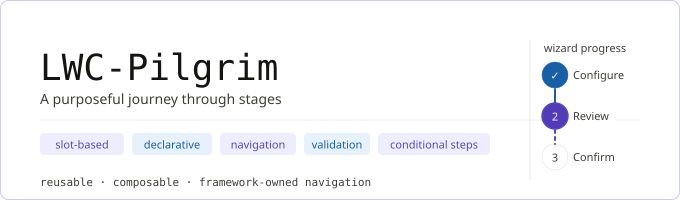

<div align="center">
  
</div>

# lwc-pilgrim

A purposeful journey through stages. A reusable multi-step wizard framework built in **vanilla LWC**. Implementors compose guided experiences declaratively; the framework owns navigation, progress indication, validation gating, and conditional steps.

## Components

| Component         | Tag                   | Role                                          |
| ----------------- | --------------------- | --------------------------------------------- |
| `pilgrimFlow`     | `c-pilgrim-flow`      | Container and engine. Exposed to App Builder. |
| `pilgrimStep`     | `c-pilgrim-step`      | Step wrapper. Internal building block.        |
| `pilgrimFlowDemo` | `c-pilgrim-flow-demo` | Working 3-step demo. Exposed to App Builder.  |

## Quick start

```html
<template>
  <c-pilgrim-flow
    show-progress
    progress-type="base"
    done-label="Submit"
    onstepchange="{handleStepChange}"
    onpilgrimdatachange="{handleFlowDataChange}"
    oncomplete="{handleComplete}"
  >
    <c-pilgrim-step label="Contact" name="contact" valid="{contactValid}">
      <lightning-input
        label="Name"
        value="{data.name}"
        data-key="name"
        onchange="{handleField}"
        required
      >
      </lightning-input>
    </c-pilgrim-step>

    <c-pilgrim-step
      label="Billing"
      name="billing"
      hidden="{skipBilling}"
      valid="{billingValid}"
    >
      <lightning-combobox
        label="Account"
        value="{data.accountId}"
        options="{accountOptions}"
        data-key="accountId"
        onchange="{handleField}"
      >
      </lightning-combobox>
    </c-pilgrim-step>

    <c-pilgrim-step label="Review" name="review">
      <p>{data.name}</p>
    </c-pilgrim-step>
  </c-pilgrim-flow>
</template>
```

## `c-pilgrim-flow` props

| Prop            | Type            | Default  | Description                                                 |
| --------------- | --------------- | -------- | ----------------------------------------------------------- |
| `show-progress` | Boolean         | `false`  | Renders `lightning-progress-indicator` above the step body. |
| `progress-type` | String          | `'base'` | `'base'` or `'path'`.                                       |
| `back-label`    | String          | `'Back'` | Back button label.                                          |
| `next-label`    | String          | `'Next'` | Next button label.                                          |
| `done-label`    | String          | `'Done'` | Done button label (last step).                              |
| `data`          | Object          | `{}`     | Seeds the shared context.                                   |
| `flowData`      | Object (getter) | —        | Read-only snapshot of the current shared context.           |

## `c-pilgrim-flow` events

| Event               | Detail                      | When                                             |
| ------------------- | --------------------------- | ------------------------------------------------ |
| `stepchange`        | `{ name, index, flowData }` | User navigates to a new step.                    |
| `pilgrimdatachange` | `{ flowData }`              | A descendant wrote to the shared context.        |
| `complete`          | `{ flowData }`              | User clicks Done on the last visible valid step. |

## `c-pilgrim-step` props

| Prop     | Type    | Default | Description                            |
| -------- | ------- | ------- | -------------------------------------- |
| `label`  | String  | —       | Text in the progress indicator.        |
| `name`   | String  | —       | Stable key for navigation and events.  |
| `valid`  | Boolean | `true`  | When `false`, blocks Next/Done.        |
| `hidden` | Boolean | `false` | When `true`, step is skipped entirely. |

## Shared context

Descendants write into the shared context with a `pilgrimdatawrite` event; the flow merges and re-emits `pilgrimdatachange` upward to the host.

```js
// single key
this.dispatchEvent(
  new CustomEvent("pilgrimdatawrite", {
    bubbles: true,
    composed: true,
    detail: { key: "accountId", value: "ACC-001" }
  })
);

// patch multiple keys
this.dispatchEvent(
  new CustomEvent("pilgrimdatawrite", {
    bubbles: true,
    composed: true,
    detail: { patch: { accountId: "ACC-001", tier: "gold" } }
  })
);
```

## Deploy

```bash
sf project deploy start \
  -d force-app/main/default/lwc/pilgrimFlow \
  -d force-app/main/default/lwc/pilgrimStep \
  -d force-app/main/default/lwc/pilgrimFlowDemo
```

Then drop **Pilgrim Flow Demo** onto any Lightning App Page, Record Page, or Home Page.

## Local dev preview

```bash
sf lightning dev component --name pilgrimFlowDemo -o <org-alias>
```

## Tests

```bash
npm run test:unit
npm run lint
npm run prettier
```

## License

MIT
